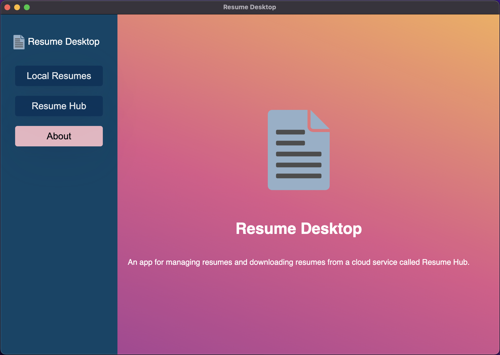
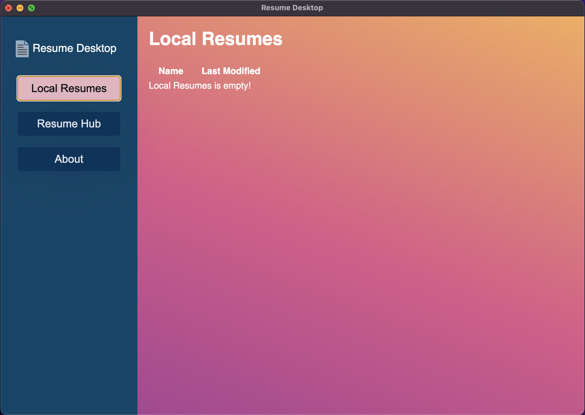

# Resume Desktop

Resume Desktop is the frontend component for
[Resume-As-A-Service](https://github.com/spratt/raas). It uses the following technologies:

1. Electron
2. React
3. TypeScript

It was forked from
[electron-react-boilerplate](https://github.com/electron-react-boilerplate/electron-react-boilerplate).

## Demo






## Starting Development

Start the app in the `dev` environment:

```bash
npm start
```

## Packaging for Production

To package apps for the local platform:

```bash
npm run package
```

## Maintainers

- [Simon Pratt](https://github.com/spratt)

## License

MIT License with various copyright owners. See LICENSE file for details.

## Attributions

- Royalty-free document icon from https://pixabay.com/vectors/document-icon-computer-web-309065/
